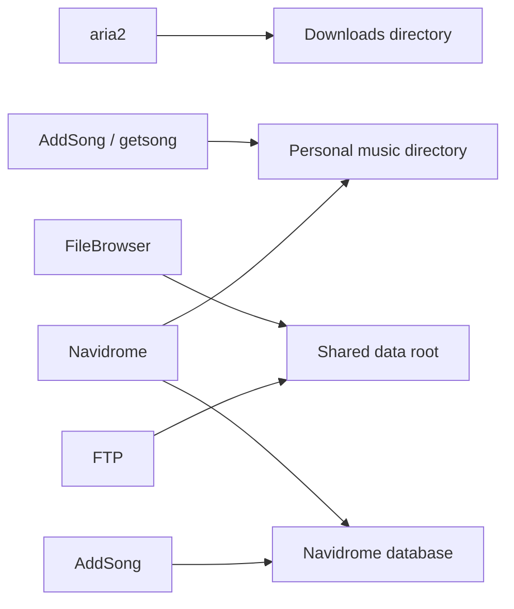

# Storage and data flow

## Persistence layout

| Path | Purpose | Observed state |
|---|---|---|
| Shared data root | FileBrowser and FTP content | about 4.5 GB at audit |
| Downloads directory | aria2 downloads | about 2.7 GB |
| Personal media directory | personal data and music tree | about 1.8 GB |
| Navidrome database | catalogue/state | about 4.6 MB |
| FileBrowser database | application state | about 64 KB |
| aria2 session file | resumable session state | empty at audit |

## Flow

FileBrowser and FTP expose the shared file root. Navidrome reads the configured music directory and stores catalogue state in its own data directory. AddSong reads Navidrome's SQLite database to search or find a media file for deletion, and invokes `getsong.sh` for downloads.

## Backup and retention

**KNOWN LIMITATION:** Navidrome periodic backup is disabled. No broader backup destination or schedule has been verified. Do not interpret aria2 session persistence as backup.

Persistent files and directories show extended ACL markers in the audit output. Their exact ACL semantics are **NOT YET VERIFIED**.
