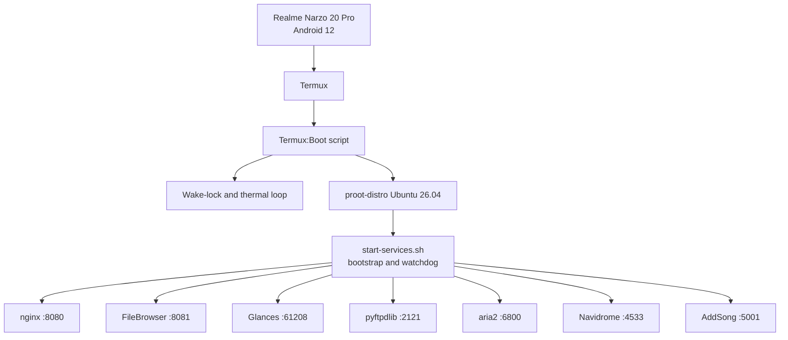

# Narzo Server Diagrams

These diagrams are logical and evidence-led. They show observed relationships while omitting credentials, secrets, and unverified public-exposure claims.

## Runtime stack



## HTTP and data path

```mermaid
flowchart LR
    LAN[LAN client] --> Nginx[nginx :8080]
    Tailnet[Tailscale peer] --> Nginx
    Nginx --> Dashboard[Dashboard and static AriaNg]
    Nginx --> FB[FileBrowser :8081]
    Nginx --> ND[Navidrome :4533]
    Nginx --> AS[AddSong :5001]
    Aria2[aria2] --> Downloads[/root/files/Aria Downloads]
    AS --> Music[/root/files/personal/.../music]
    FB --> Files[/root/files]
    FTP[FTP on tailnet] --> Files
    ND --> Music
    ND --> NavDB[/root/navidrome/navidrome.db]
    AS --> NavDB
```

## Exposure boundary

```text
Confirmed LAN reachability
  10.248.33.58:8080, :8081, :61208, :6800, :4533

Confirmed tailnet reachability
  100.70.24.74:8080, :2121, nginx /add-api/ route

Unknown
  Router forwarding, IPv6 inbound policy, UPnP/NAT-PMP,
  Tailscale Funnel, and Internet reachability
```

See [network and exposure](../architecture/network-and-exposure.md) for the evidence behind each boundary.

